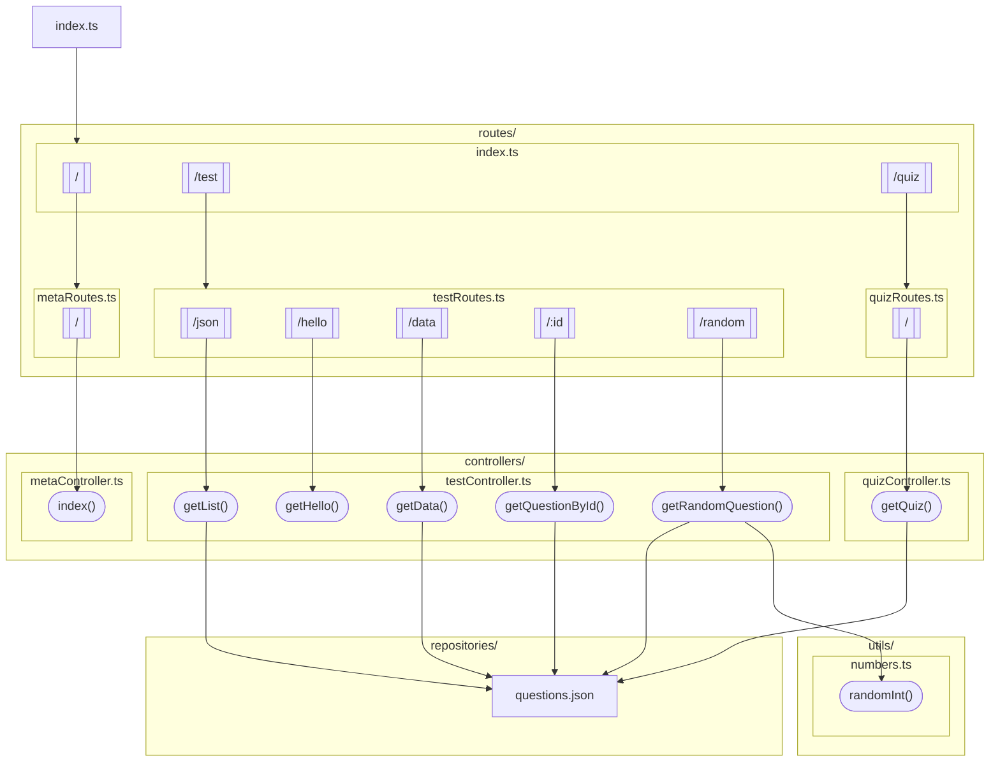

# Structure

```mermaid
    graph TD

    index["index.ts"]

    subgraph routes/
        subgraph rIndex["index.ts"]
            rI_[["/"]]
            rITest[["/test"]]
            rIQuiz[["/quiz"]]
        end

        subgraph rMeta["metaRoutes.ts"]
            rM_[["/"]]
        end

        subgraph rTest["testRoutes.ts"]
            rTJson[["/json"]]
            rTHello[["/hello"]]
            rTData[["/data"]]
            rTId[["/:id"]]
            rTRandom[["/random"]]
        end

        subgraph rQuiz["quizRoutes.ts"]
            rQ_[["/"]]
        end
    end

    subgraph controllers/
        subgraph cMeta["metaController.ts"]
            fIndex(["index()"])
        end

        subgraph cTest["testController.ts"]
            fTGetList(["getList()"])
            fTGetHello(["getHello()"])
            fTGetData(["getData()"])
            fTGetQuestionById(["getQuestionById()"])
            fTGetRandomQuestion(["getRandomQuestion()"])
        end

        subgraph cQuiz["quizController.ts"]
            fQGetQuiz(["getQuiz()"])
        end
    end

    subgraph repositories/
        repoQues["questions.json"]
    end

    subgraph utils/
        subgraph uNum["numbers.ts"]
            uNRandomInt(["randomInt()"])
        end
    end

    index ---> rIndex
        rI_ ---> rMeta
        rITest ---> rTest
        rIQuiz ---> rQuiz
    
    rM_ ---> fIndex
    
    rTJson ---> fTGetList
        fTGetList ---> repoQues
    rTHello ---> fTGetHello
    rTData ---> fTGetData
        fTGetData ---> repoQues
    rTId ---> fTGetQuestionById
        fTGetQuestionById ---> repoQues
    rTRandom ---> fTGetRandomQuestion
        fTGetRandomQuestion ---> repoQues
        fTGetRandomQuestion ---> uNRandomInt

    rQ_ ---> fQGetQuiz
        fQGetQuiz ---> repoQues
```
