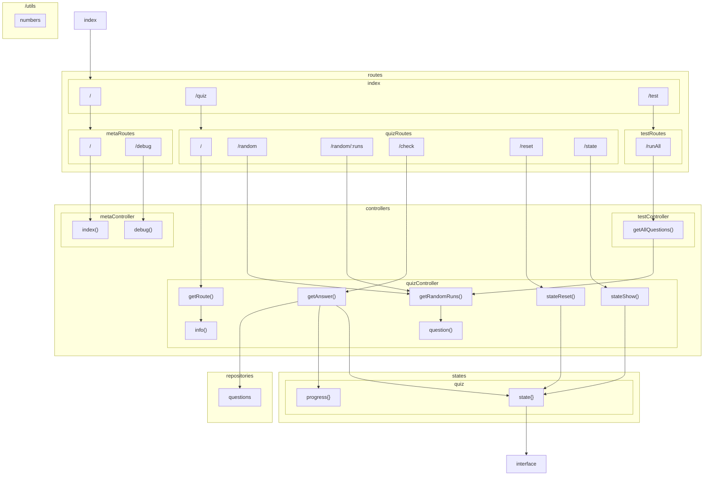

# App Flow

## Mermaid Chart

```mermaid
graph TD
_indx["index"]
_inte["interface"]

subgraph rou["routes"]
    subgraph rouInd["index"]
        rouIndx_0000["/"]
        rouIndx_quiz["/quiz"]
        rouIndx_test["/test"]
    end

    subgraph rouMeta["metaRoutes"]
        rouMeta_0000["/"]
        rouMeta_debu["/debug"]
    end

    subgraph rouQuiz["quizRoutes"]
        rouQuiz_0000["/"]
        rouQuiz_rand["/random"]
        rouQuiz_runs["/random/:runs"]
        rouQuiz_answ["/check"]
        rouQuiz_rese["/reset"]
        rouQuiz_stat["/state"]
    end

    subgraph rouTest["testRoutes"]
        rouTest_rAll["/runAll"]
    end
end

subgraph con["controllers"]
    subgraph conMeta["metaController"]
        conMeta_indx["index()"]
        conMeta_debu["debug()"]
    end

    subgraph conQuiz["quizController"]
        conQuiz_gRou["getRoute()"]
        conQuiz_gRun["getRandomRuns()"]
        conQuiz_gAns["getAnswer()"]
        conQuiz_sRes["stateReset()"]
        conQuiz_sSho["stateShow()"]
        conQuiz_info["info()"]
        conQuiz_ques["question()"]
    end

    subgraph conTest["testController"]
        conTest_gAll["getAllQuestions()"]
    end
end

subgraph sta["states"]
    subgraph staQuiz["quiz"]
        staQuiz_stat["state{}"]
        staQuiz_prog["progress{}"]
    end
end

subgraph rep["repositories"]
    repQuiz["questions"]
end

subgraph uti["/utils"]
    subgraph utiNum["numbers"]
    end
end

_indx ---> rouInd

rouIndx_0000 --> rouMeta
rouIndx_quiz --> rouQuiz
rouIndx_test --> rouTest

rouMeta_0000 ---> conMeta_indx
rouMeta_debu ---> conMeta_debu

rouQuiz_rese ---> conQuiz_sRes
rouQuiz_stat ---> conQuiz_sSho
rouQuiz_0000 ---> conQuiz_gRou
rouQuiz_rand & rouQuiz_runs ---> conQuiz_gRun
rouQuiz_answ ---> conQuiz_gAns

rouTest_rAll ---> conTest_gAll

conQuiz_sSho & conQuiz_sRes ---> staQuiz_stat
conQuiz_gRou --> conQuiz_info
conQuiz_gRun --> conQuiz_ques
conQuiz_gAns ---> staQuiz_stat & staQuiz_prog & repQuiz

conTest_gAll ---> conQuiz_gRun

staQuiz_stat ---> _inte
```
