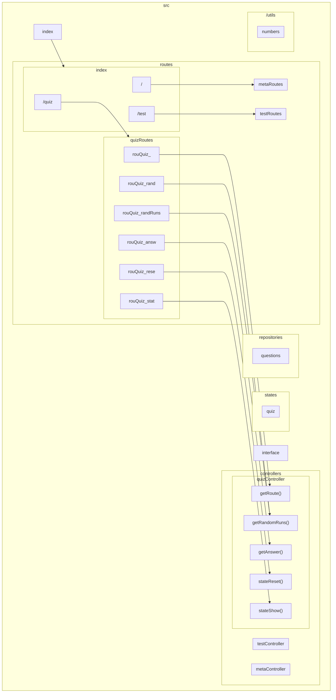

# App Flow

## Mermaid Chart

```mermaid
graph TD
subgraph src["src"]
    _ind["index"]
    _int["interface"]

    subgraph rou["routes"]
        subgraph rouInd["index"]
            rouInd_["/"]
            rouInd_quiz["/quiz"]
            rouInd_test["/test"]
        end

        subgraph rouMeta["metaRoutes"]
        end

        subgraph rouQuiz["quizRoutes"]
            rouQuiz_
            rouQuiz_rand
            rouQuiz_randRuns
            rouQuiz_answ
            rouQuiz_rese
            rouQuiz_stat
        end

        subgraph rouTest["testRoutes"]
        end
    end

    subgraph con["controllers"]
        subgraph conMeta["metaController"]
        end

        subgraph conQuiz["quizController"]
            conQuiz_getRoute["getRoute()"]
            conQuiz_getRandomRuns["getRandomRuns()"]
            conQuiz_getAnswer["getAnswer()"]
            conQuiz_stateReset["stateReset()"]
            conQuiz_stateShow["stateShow()"]
        end

        subgraph conTest["testController"]
        end
    end

    subgraph sta["states"]
        subgraph staQuiz["quiz"]
        end
    end

    subgraph rep["repositories"]
        repQ["questions"]
    end

    subgraph uti["/utils"]
        subgraph utiNum["numbers"]
        end
    end
end

_ind ---> rouInd
rouInd_ ---> rouMeta
rouInd_quiz ---> rouQuiz
rouInd_test ---> rouTest
rouQuiz_ ---> conQuiz_getRoute
rouQuiz_rand ---> conQuiz_getRandomRuns
rouQuiz_randRuns ---> conQuiz_getRandomRuns
rouQuiz_answ ---> conQuiz_getAnswer
rouQuiz_rese ---> conQuiz_stateReset
rouQuiz_stat ---> conQuiz_stateShow
```
