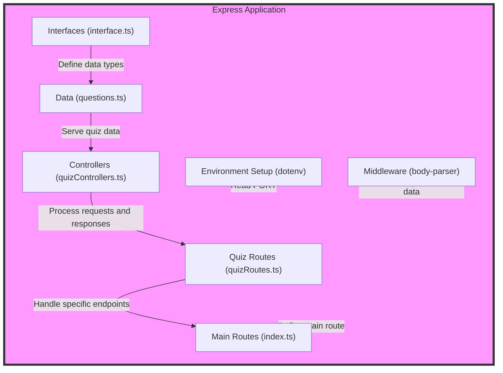

# Project Structure

```mermaid
flowchart TB
    subgraph ExpressApp["Express Application"]
			direction TB
			Setup["Environment Setup (dotenv)"]
			Middleware["Middleware (body-parser)"]
			MainRoutes["Main Routes (index.ts)"]
			QuizRoutes["Quiz Routes (quizRoutes.ts)"]
			Controllers["Controllers (quizControllers.ts)"]
			Data["Data (questions.ts)"]
			Interfaces["Interfaces (interface.ts)"]
    end

    Setup -->|Read PORT| ExpressApp
    Middleware -->|Parse JSON/URL-encoded data| ExpressApp
    MainRoutes -->|Define main route| ExpressApp
    QuizRoutes -->|Handle specific endpoints| MainRoutes
    Controllers -->|Process requests and responses| QuizRoutes
    Data -->|Serve quiz data| Controllers
    Interfaces -->|Define data types| Data

    style ExpressApp fill:#f9f,stroke:#333,stroke-width:4px

```
